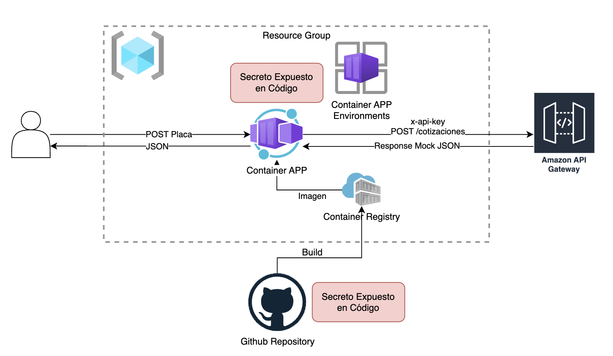
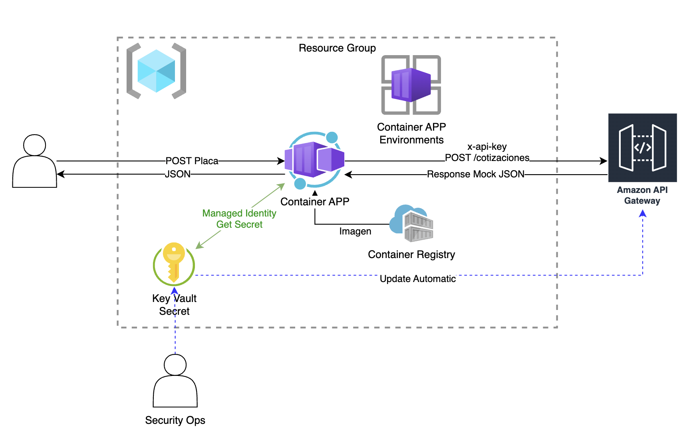

# MOD6-LAB2: Azure Container App consumiendo Azure Key Vault para invocar un API Gateway Mock en AWS

**Instructor:** Miguel Leyva  

---

# 1. Objetivo y Alcance

## Objetivo

Implementar una API containerizada que exponga un endpoint de cotización vehicular y consuma de forma segura una API Key almacenada en Azure Key Vault, utilizando una **Managed Identity** para autenticarse sin almacenar credenciales sensibles en el código fuente ni en la configuración del contenedor.

## Alcance

Al finalizar el laboratorio, el alumno habrá implementado:

- Una API HTTP desarrollada en Node.js y Express.
- Un contenedor Docker de la aplicación.
- Un Azure Container Registry para almacenar la imagen.
- Un Azure Container Apps Environment.
- Una Azure Container App.
- Un Azure Key Vault para almacenar la API Key de AWS API Gateway.
- Una identidad administrada asignada por usuario.
- Roles Azure RBAC mínimos:
  - `Key Vault Secrets User` sobre Key Vault.
  - `AcrPull` sobre Azure Container Registry.
- Pruebas básicas:
  - Solicitud exitosa.

---

# 2. Prerrequisitos y Herramientas

## Prerrequisitos funcionales

El alumno debe contar con un API Gateway Mock en AWS:

| Elemento | Ejemplo |
|---|---|
| Endpoint | `https://<api-id>.execute-api.<region>.amazonaws.com/dev/cotizaciones` |
| Método | `POST /cotizaciones` |
| Header requerido | `x-api-key` |
| API Key | Valor generado en AWS API Gateway |

## Herramientas requeridas

| Herramienta | Uso |
|---|---|
| Azure CLI | Crear y administrar recursos de Azure |
| Extensión `containerapp` | Crear Azure Container Apps |
| Node.js | Validar o ejecutar la aplicación localmente |
| npm | Instalar dependencias si se prueba localmente |
| curl | Probar endpoints |

> Docker local es opcional. El laboratorio usa `az acr build`, por lo que Azure Container Registry construye la imagen en la nube.

## Preparar el entorno de ejecución

```bash
az login
az account list --output table

#Reemplazar por el ID de Suscripcion
az account set --subscription "<ID-DE-LA-SUSCRIPCION>"

az extension add --name containerapp --upgrade
az provider register --namespace Microsoft.App
az provider register --namespace Microsoft.ContainerRegistry
az provider register --namespace Microsoft.ManagedIdentity
az provider register --namespace Microsoft.KeyVault
```

## Descargar el código fuente

```bash
git clone https://github.com/mleyvag/MOD6-LAB2.git

cd MOD6-LAB2
```
---

## Código fuente del laboratorio

El código fuente se entrega en el directorio:

```text
app/
├── Dockerfile
├── package.json
└── src/
    └── app.js
```

Archivos principales:

| Archivo | Propósito |
|---|---|
| `package.json` | Define dependencias y script de arranque |
| `src/app.js` | Implementa la API Express y lectura de Key Vault |
| `Dockerfile` | Construye la imagen del contenedor |

La aplicación expone:

| Método | Ruta | Uso |
|---|---|---|
| `GET` | `/health` | Validación básica de disponibilidad |
| `POST` | `/cotizaciones` | Cotización vehicular |

---

## Preparar variables del laboratorio

Definir un sufijo único. Puede usar iniciales.

```bash
# Agregar las iniciales
export SUFFIX="<INICIALES>"
```

Definir el Resource Group. Si ya existe, usar su nombre real.

```bash
export RG="<RESOURCE-GROUP>"
export LOCATION="eastus"
```

Definir nombres de recursos:

```bash
export ACR_NAME="acrcot${SUFFIX}"
export CONTAINER_ENV="cae-cotizador-${SUFFIX}"
export CONTAINER_APP="aca-cotizador-kv-${SUFFIX}"
export MANAGED_IDENTITY="id-cotizador-kv-${SUFFIX}"
export KEY_VAULT="kv-cotizador-${SUFFIX}"

export IMAGE_NAME="cotizador-keyvault"
export IMAGE_TAG="1.0.0"
export SECRET_NAME="aws-cotizador-api-key"

#Reemplaza por el Endpoint correcto
export AWS_COTIZADOR_ENDPOINT="https://7z5zfmc7jl.execute-api.us-east-1.amazonaws.com/dev/cotizaciones"
```

Validar:

```bash
echo "Resource Group:       $RG"
echo "Location:             $LOCATION"
echo "ACR:                  $ACR_NAME"
echo "Container Env:        $CONTAINER_ENV"
echo "Container App:        $CONTAINER_APP"
echo "Managed Identity:     $MANAGED_IDENTITY"
echo "Key Vault:            $KEY_VAULT"
echo "AWS Endpoint:         $AWS_COTIZADOR_ENDPOINT"
```

---

# 3. El Problema (ASIS)

## Contexto

**Seguros Andinos** necesita exponer una API de cotización vehicular. La API recibe una placa, construye una solicitud y consume un servicio externo publicado como **AWS API Gateway Mock**.

El API externo exige enviar una API Key mediante el header:

```http
x-api-key: <valor-secreto>
```

En una primera implementación, el equipo de desarrollo resolvió el problema de forma rápida almacenando la API Key directamente en la aplicación, por ejemplo:

```javascript
const AWS_API_KEY = "<CLAVE-SENSIBLE>";
```

Con este diseño la aplicación puede funcionar, pero la credencial queda expuesta dentro del ciclo de vida del software.

## Riesgos identificados

| Riesgo | Impacto |
|---|---|
| API Key dentro del código fuente | Puede filtrarse en Git, respaldos, revisiones de código o imágenes del contenedor |
| API Key dentro de variables visibles | Operadores o usuarios con acceso a configuración podrían verla o copiarla |
| Rotación manual de credenciales | Cambiar la API Key obliga a modificar código, reconstruir imagen o redeplegar configuración sensible |
| Falta de separación de responsabilidades | Desarrollo termina administrando secretos directamente |
| Sin mínimo privilegio | El acceso a la API Key depende de quién pueda ver el código o la configuración |

## Arquitectura ASIS



## Problema central

El problema no es solamente que la aplicación consuma un API externo. El problema es que la credencial usada para invocar ese API puede terminar mezclada con código, imágenes, configuración o procesos operativos.

Una API Key debe tratarse como secreto. Por lo tanto, debe almacenarse en un servicio especializado, accederse con una identidad controlada y rotarse sin cambiar el código fuente.

---

# 4. La Solución (TOBE)

## Propuesta

La solución consiste en mover la API Key a **Azure Key Vault** y permitir que la aplicación la lea usando una **Managed Identity** asignada a la Azure Container App.

La aplicación se despliega como contenedor en **Azure Container Apps**. La imagen se almacena en **Azure Container Registry** y se descarga desde la Container App usando la misma identidad administrada, sin habilitar usuario administrador del registry.

## Decisiones de diseño

| Decisión | Justificación |
|---|---|
| Azure Key Vault para almacenar la API Key | Centraliza el secreto y evita incluirlo en código o variables visibles |
| User-Assigned Managed Identity | Permite identificar explícitamente qué identidad usa la aplicación |
| Rol `Key Vault Secrets User` | Otorga solo lectura de secretos, aplicando mínimo privilegio |
| Rol `AcrPull` sobre ACR | Permite descargar la imagen sin usuario/password del registry |
| `admin-enabled false` en ACR | Evita credenciales estáticas de administrador |
| Endpoint AWS como variable de entorno | La URL no es secreta; puede configurarse sin exponer la API Key |

## Flujo esperado

1. El cliente invoca `POST /cotizaciones` en la Azure Container App.
2. La aplicación valida la placa recibida.
3. La aplicación usa `DefaultAzureCredential` y la Managed Identity asignada.
4. Azure Key Vault valida que la identidad tenga el rol `Key Vault Secrets User`.
5. La aplicación obtiene el valor del secreto `aws-cotizador-api-key`.
6. La aplicación invoca AWS API Gateway enviando la API Key en el header `x-api-key`.
7. La respuesta del proveedor se devuelve al cliente sin exponer la API Key.

## Arquitectura TOBE



## Resultado de seguridad esperado

Al aplicar esta solución:

- La API Key no queda en el repositorio.
- La API Key no queda dentro de la imagen del contenedor.
- La API Key no se configura como variable de entorno.
- La Container App accede al secreto usando identidad administrada.
- El permiso de lectura del secreto puede revocarse desde Azure RBAC.
- La API Key puede rotarse actualizando el valor del secreto en Key Vault.

# 5. Laboratorio Guiado:

## Fase 1. Crear Resource Group si no existe (OMITIR PASO)

```bash
az group create \
  --name "$RG" \
  --location "$LOCATION"
```

## Fase 2. Crear Azure Container Registry

```bash
az acr create \
  --resource-group "$RG" \
  --name "$ACR_NAME" \
  --sku Basic \
  --admin-enabled false
```

Obtener datos del registry:

```bash
export ACR_ID=$(az acr show \
  --name "$ACR_NAME" \
  --resource-group "$RG" \
  --query id \
  --output tsv)

export ACR_LOGIN_SERVER=$(az acr show \
  --name "$ACR_NAME" \
  --resource-group "$RG" \
  --query loginServer \
  --output tsv)
```

Validar:

```bash
az acr show \
  --name "$ACR_NAME" \
  --resource-group "$RG" \
  --query "{name:name, loginServer:loginServer, adminUserEnabled:adminUserEnabled}" \
  --output table
```

El valor `adminUserEnabled` debe ser `false`, porque la Container App descargará la imagen usando Managed Identity y RBAC.

## Fase 3. Crear Managed Identity

```bash
az identity create \
  --name "$MANAGED_IDENTITY" \
  --resource-group "$RG" \
  --location "$LOCATION"
```

Obtener identificadores:

```bash
export MI_ID=$(az identity show \
  --name "$MANAGED_IDENTITY" \
  --resource-group "$RG" \
  --query id \
  --output tsv)

export MI_CLIENT_ID=$(az identity show \
  --name "$MANAGED_IDENTITY" \
  --resource-group "$RG" \
  --query clientId \
  --output tsv)

export MI_PRINCIPAL_ID=$(az identity show \
  --name "$MANAGED_IDENTITY" \
  --resource-group "$RG" \
  --query principalId \
  --output tsv)
```

Resumen de identificadores:

| Variable | Qué identifica | Uso principal |
|---|---|---|
| `MI_ID` | Recurso Azure de la identidad | Asociarla a Container Apps |
| `MI_CLIENT_ID` | App/Client ID en Microsoft Entra ID | Indicar qué identidad usa el código |
| `MI_PRINCIPAL_ID` | Object ID del service principal | Asignar roles RBAC |

## Fase 4. Permitir que la identidad descargue imágenes desde ACR

```bash
az role assignment create \
  --assignee-object-id "$MI_PRINCIPAL_ID" \
  --assignee-principal-type ServicePrincipal \
  --role "AcrPull" \
  --scope "$ACR_ID"
```

---

## Fase 5. Crear Key Vault

```bash
az keyvault create \
  --name "$KEY_VAULT" \
  --resource-group "$RG" \
  --location "$LOCATION" \
  --enable-rbac-authorization true \
  --enable-purge-protection true \
  --retention-days 7
```

Obtener el identificador:

```bash
export KEY_VAULT_ID=$(az keyvault show \
  --name "$KEY_VAULT" \
  --resource-group "$RG" \
  --query id \
  --output tsv)
```

## Fase 6. Autorizar al usuario actual para cargar secretos

```bash
export CURRENT_USER_ID=$(az ad signed-in-user show \
  --query id \
  --output tsv)

az role assignment create \
  --assignee-object-id "$CURRENT_USER_ID" \
  --assignee-principal-type User \
  --role "Key Vault Secrets Officer" \
  --scope "$KEY_VAULT_ID"
```

> Si la creación inmediata del secreto falla por autorización, esperar unos minutos. Las asignaciones RBAC pueden tardar en propagarse.

## Fase 7. Cargar la API Key de AWS en Key Vault

```bash
# Ingresar el API Key correcto
export AWS_API_KEY="8Adba0Bi3S17rLnM5xJUeLUO9TW4scS1uZuEV8L6"

echo $AWS_API_KEY

az keyvault secret set \
  --vault-name "$KEY_VAULT" \
  --name "$SECRET_NAME" \
  --value "$AWS_API_KEY" \
  --description "API Key del API Gateway mock de cotizacion vehicular"

unset AWS_API_KEY
```

Validar que el secreto existe sin mostrar su valor:

```bash
az keyvault secret show \
  --vault-name "$KEY_VAULT" \
  --name "$SECRET_NAME" \
  --query "{name:name, enabled:attributes.enabled, created:attributes.created}" \
  --output table
```

## Fase 8. Autorizar a la identidad para leer secretos

```bash
az role assignment create \
  --assignee-object-id "$MI_PRINCIPAL_ID" \
  --assignee-principal-type ServicePrincipal \
  --role "Key Vault Secrets User" \
  --scope "$KEY_VAULT_ID"
```

---

## Fase 9. Construir la imagen en ACR

Ejecutar desde la raíz del repositorio:

```bash
az acr build \
  --registry "$ACR_NAME" \
  --image "$IMAGE_NAME:$IMAGE_TAG" \
  app
```

Validar que la imagen existe:

```bash
az acr repository show-tags \
  --name "$ACR_NAME" \
  --repository "$IMAGE_NAME" \
  --output table
```

## Fase 10. Crear Container Apps Environment

```bash
az containerapp env create \
  --name "$CONTAINER_ENV" \
  --resource-group "$RG" \
  --location "$LOCATION"
```

## Fase 11. Crear Azure Container App

```bash
az containerapp create \
  --name "$CONTAINER_APP" \
  --resource-group "$RG" \
  --environment "$CONTAINER_ENV" \
  --image "${ACR_LOGIN_SERVER}/${IMAGE_NAME}:${IMAGE_TAG}" \
  --target-port 3000 \
  --ingress external \
  --min-replicas 0 \
  --max-replicas 3 \
  --user-assigned "$MI_ID" \
  --registry-server "$ACR_LOGIN_SERVER" \
  --registry-identity "$MI_ID" \
  --env-vars \
    KEY_VAULT_URL="https://${KEY_VAULT}.vault.azure.net/" \
    AWS_COTIZADOR_API_KEY_SECRET_NAME="$SECRET_NAME" \
    AWS_COTIZADOR_ENDPOINT="$AWS_COTIZADOR_ENDPOINT" \
    AZURE_CLIENT_ID="$MI_CLIENT_ID"
```

Obtener la URL pública:

```bash
export CONTAINER_APP_FQDN=$(az containerapp show \
  --name "$CONTAINER_APP" \
  --resource-group "$RG" \
  --query properties.configuration.ingress.fqdn \
  --output tsv)

export CONTAINER_APP_URL="https://${CONTAINER_APP_FQDN}/cotizaciones"

echo "$CONTAINER_APP_URL"
```

---

# 6. Pruebas básicas

## Escenario A. Solicitud exitosa con placa válida

```bash
curl --request POST \
  --url "$CONTAINER_APP_URL" \
  --header "Content-Type: application/json" \
  --data '{
    "placa": "ABC-123",
    "anioFabricacion": 2023,
    "uso": "PARTICULAR"
  }'
```

Resultado esperado:

```json
{
  "origen": "AZURE_CONTAINER_APP_SECURE_PROXY",
  "solicitud": {
    "placa": "ABC-123",
    "anioFabricacion": 2023,
    "uso": "PARTICULAR"
  },
  "proveedor": "AWS_API_GATEWAY_MOCK",
  "resultado": {}
}
```

> El contenido de `resultado` dependerá de la respuesta configurada en el API Gateway Mock.

# 7. Ejercicio Propuesto: actualizar la API Key del mismo API

## Contexto

El proveedor externo rota la API Key del mismo API Gateway Mock. El endpoint no cambia, pero la clave anterior deja de ser válida.

El objetivo del ejercicio es actualizar el secreto en Azure Key Vault sin modificar el código fuente, sin reconstruir la imagen y sin recrear la Container App.

## Actividad 1. Actualizar el secreto en Key Vault

```bash
# Agregar el nuevo API Key
export AWS_API_KEY_NUEVA="Ht2w5a2OG4ChhpfSC6VS98QA2EQLipd7bB2aJCPj"

echo $AWS_API_KEY_NUEVA

az keyvault secret set \
  --vault-name "$KEY_VAULT" \
  --name "$SECRET_NAME" \
  --value "$AWS_API_KEY_NUEVA" \
  --description "API Key actualizada del API Gateway mock de cotizacion vehicular"

unset AWS_API_KEY_NUEVA
```

## Actividad 2. Validar que se creó una nueva versión del secreto

```bash
az keyvault secret list-versions \
  --vault-name "$KEY_VAULT" \
  --name "$SECRET_NAME" \
  --query "[].{id:id, enabled:attributes.enabled, created:attributes.created}" \
  --output table
```

## Actividad 3. Ejecutar nuevamente la prueba exitosa

```bash
curl --request POST \
  --url "$CONTAINER_APP_URL" \
  --header "Content-Type: application/json" \
  --data '{
    "placa": "ABC-123",
    "anioFabricacion": 2023,
    "uso": "PARTICULAR"
  }'
```

Resultado esperado:

```text
HTTP 200
```

# 8. Limpieza de Recursos (Sin borrar el RG)

Esta limpieza elimina los recursos creados por el laboratorio, pero conserva el Resource Group.

> Importante: el Key Vault fue creado con purge protection habilitado. Al eliminarlo, quedará en estado soft-deleted durante el periodo de retención configurado. Durante ese tiempo, el nombre del Key Vault no podrá reutilizarse.

## Opción recomendada: eliminar recursos por nombre

Eliminar la Container App:

```bash
az containerapp delete \
  --name "$CONTAINER_APP" \
  --resource-group "$RG" \
  --yes
```

Eliminar el Container Apps Environment:

```bash
az containerapp env delete \
  --name "$CONTAINER_ENV" \
  --resource-group "$RG" \
  --yes
```

Eliminar Azure Container Registry:

```bash
az acr delete \
  --name "$ACR_NAME" \
  --resource-group "$RG" \
  --yes
```

Eliminar la Managed Identity:

```bash
az identity delete \
  --name "$MANAGED_IDENTITY" \
  --resource-group "$RG"
```

Eliminar Azure Key Vault:

```bash
az keyvault delete \
  --name "$KEY_VAULT" \
  --resource-group "$RG"
```

## Validar recursos restantes

Listar recursos que todavía permanecen en el Resource Group:

```bash
az resource list \
  --resource-group "$RG" \
  --output table
```

Si el Resource Group se usa para otros laboratorios, revisar cuidadosamente la salida antes de borrar cualquier recurso adicional.

## Limpieza opcional de variables locales

```bash
unset ACR_NAME
unset CONTAINER_ENV
unset CONTAINER_APP
unset MANAGED_IDENTITY
unset KEY_VAULT
unset IMAGE_NAME
unset IMAGE_TAG
unset SECRET_NAME
unset AWS_COTIZADOR_ENDPOINT
unset ACR_ID
unset ACR_LOGIN_SERVER
unset MI_ID
unset MI_CLIENT_ID
unset MI_PRINCIPAL_ID
unset KEY_VAULT_ID
unset CURRENT_USER_ID
unset CONTAINER_APP_FQDN
unset CONTAINER_APP_URL
```
